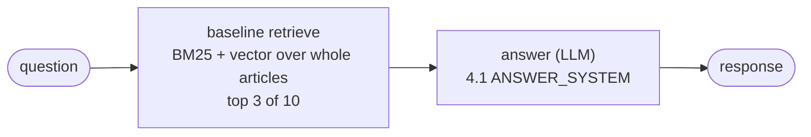
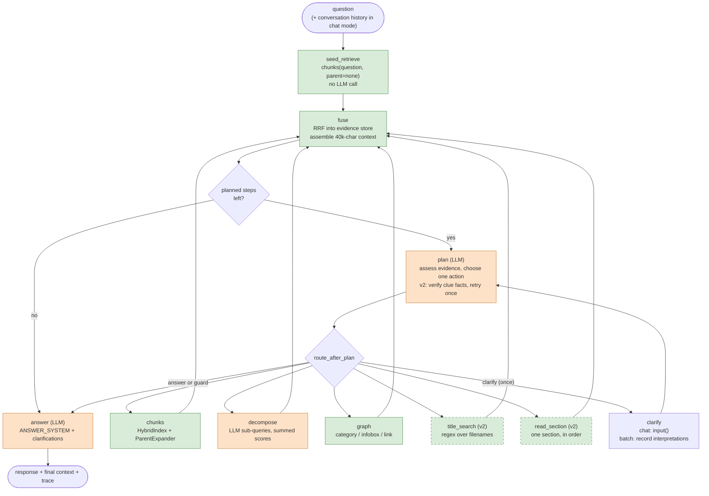

# Checkpoint 5.1 — Agent-based RAG: system design

As-built design of [`capstone_checkpoint_5_1_agent_rag_solution.py`](capstone_checkpoint_5_1_agent_rag_solution.py).
It is a LangGraph agent that plans over the Checkpoint 4.1 retrievers instead of
committing to one, compared against the fixed Checkpoint 3.1/4.1 pipeline. Prompt text in
this page is pasted from the script, not retyped.

## Contents

- [1. Task and versions](#1-task-and-versions)
- [2. v0: the fixed baseline pipeline](#2-v0-the-fixed-baseline-pipeline)
- [3. Agent workflow](#3-agent-workflow)
- [4. State](#4-state)
- [5. Tools](#5-tools)
- [6. Planner prompt](#6-planner-prompt)
- [7. Fact verification (v2)](#7-fact-verification-v2)
- [8. Answer and decompose prompts](#8-answer-and-decompose-prompts)
- [9. Evidence fusion and context assembly](#9-evidence-fusion-and-context-assembly)
- [10. Evaluation integration](#10-evaluation-integration)
- [11. Modes and command line](#11-modes-and-command-line)
- [12. Showcase tasks](#12-showcase-tasks)
- [13. `my_agent_plan()`](#13-my_agent_plan)
- [14. v2 change log](#14-v2-change-log)

## 1. Task and versions

**Task.** Answer questions over 2,419 English Wikipedia articles (the capstone
"Wikipedia Retrieval Engine" scenario), citing the articles used. Many test questions
need more than one retrieval step, for example:
- an entity that is described but not named ("the university where Barack Obama earned
  his law degree");
- a bridge fact (the year of an earthquake, then that year's Nobel laureate);
- a detail inside a long table that no single search ranks.

A fixed pipeline retrieves once and answers. The agent looks at what it retrieved,
decides what is still missing, and chooses the next retrieval, a clarifying question, or
an answer.

| | v0 (baseline, no agent) | v1 (initial agent, worksheet Step 2) | v2 (refined agent, worksheet Step 3) |
|---|---|---|---|
| Retrieval | once: whole articles, top 3 of 10 | seed (4.1 chunks) + up to 3 planned steps | same loop |
| Tools | — | `chunks`, `decompose`, `graph`, `clarify`, `answer` | adds `title_search`, `read_section` |
| Planner | — | rules 1–5 | adds rule 6 (clues + verified quotes), graph routing, section labels |
| Answer prompt | 4.1 `ANSWER_SYSTEM` | + clarification handling | + reason-then-answer, clue facts, date comparison |
| Decompose prompt | — | 4.1 `DECOMPOSE_SYSTEM` | + "use only names and facts in the question" |
| Switch | `--agent-version v0` | `--agent-version v1` | `--agent-version v2` (default) |

v1 changes nothing that 4.1 fixed. It uses the 4.1 retrievers, prompts and budgets, so its
differences from v0 come from the agent loop. v2 changes are listed with their evidence
in the [change log](#14-v2-change-log).

The 4.1 script is imported, not copied or modified. The chunk corpus, hybrid index,
parent expander, graph, judges and metrics are the same code that scored 4.1.

[↑ Contents](#contents)

## 2. v0: the fixed baseline pipeline

v0 is the worksheet's comparison point: the Checkpoint 3.1 retriever exactly as it ran as
`--retriever baseline` in 4.1.
- It indexes whole articles, with text from `extract_wikipedia_text()`.
- It fuses BM25 and vector scores at equal weight after min-max normalisation.
- It passes the top 3 of 10 candidates (about 225k characters on average) to one answer
  call with the 4.1 `ANSWER_SYSTEM`.
- `BaselinePipeline` calls the 4.1 module's own `build_retriever("baseline")` and `answer()`.
- There is no planner, loop, clarify, or memory between chat turns.



`run()` returns the same state shape as the agents, so v0 is scored and reported by the
identical code path. Its retrieved sources were checked against the 4.1 baseline run
`evaluation_baseline_20260921_161030.json`.

[↑ Contents](#contents)

## 3. Agent workflow



Orange nodes call the LLM; green nodes don't; dashed nodes are v2 only.

**How retrieval, reasoning and iteration fit together:**

1. **Seed.** Step 0 is exactly the 4.1 chunks retriever (k=8, pool 40, no parent). It
   makes no model call, and it means the planner's first decision is based on real
   evidence, including any sign of ambiguity. If the planner answers straight away, the
   agent reduces to 4.1 chunks plus one planner call.
2. **Plan.** One LLM call sees the question, any clarifications, every action taken so
   far (with how many new passages and files each produced), and up to 16,000 characters
   of the current context. It returns JSON: an assessment, the gaps it sees, and one
   action with arguments. v2 also returns the question's clues and the facts that cover
   them; see [section 7](#7-fact-verification-v2).
3. **Act.** The chosen tool runs; retrieval tools make no model call except `decompose`.
4. **Fuse.** The new hits join an evidence store keyed by unit id and are merged by
   reciprocal rank. The context is rebuilt within a 40,000-character budget.
5. **Repeat or stop.** The planner runs again while planned steps remain.

The loop ends when:
- the planner chooses `answer`;
- 3 planned retrievals are used, in which case `fuse` goes straight to `answer` without a
  planner call;
- a guard trips: an unparseable reply, a repeated action, an unknown action, or a second
  clarify.

`stop_reason` records which. A query therefore makes at most 3 planner calls, plus one
per clarify and, in v2, up to one verification retry per planner call.

**Design choices:**
- **Plan and analyze are one node.** The planner sees the evidence each time it runs, so a
  separate analyzer would double the calls without adding information.
- **Guards live in code, not in the prompt.**
- **Tools take arguments rather than being sub-agents.** For example, `chunks` takes a
  `parent` width and `graph` takes relation kinds. Sub-agents would give the same control
  with more calls and prompts to debug.

[↑ Contents](#contents)

## 4. State

```python
ActionName = Literal["chunks", "decompose", "graph", "title_search", "read_section", "clarify", "answer"]
StopReason = Literal["planner_answer", "step_budget", "parse_failure", "repeat_action",
                     "clarify_limit", "unknown_action", "unverified_answer", "fixed_pipeline"]

class PlannedAction(TypedDict):          # the planner's parsed JSON reply
    action: ActionName
    args: dict[str, Any]
    assessment: str                      # one sentence on what the evidence covers
    missing: list[str]                   # gaps the planner sees (recorded, not checked)
    clues: list[str]                     # v2: the conditions the question sets
    facts: list[dict[str, Any]]          # v2: {clue, fact, source, quote, verified, reason}

class StepRecord(TypedDict):             # one executed step: seed, retrieval, or clarify
    step: int                            # 0 = seed
    action: ActionName | Literal["seed"]
    args: dict[str, Any]
    assessment: str
    missing: list[str]
    clues: list[str]
    facts: list[dict[str, Any]]
    ranked_unit_ids: list[str]           # this step's ranked output, before fusion
    new_unit_ids: list[str]              # not already in the evidence store
    files: list[str]
    trace: dict[str, Any]                # 4.1 tool trace: sub_queries, matched_categories, ...
    seconds: float                       # tool time excluding model calls
    error: str | None                    # e.g. an unknown section; shown to the planner

class EvidenceEntry(TypedDict):
    hit: Hit                             # the 4.1 Hit, reused unchanged
    rrf: float
    first_step: int
    step_ranks: dict[int, int]

class AgentState(TypedDict):
    question: str
    mode: Literal["batch", "chat"]
    version: Literal["v1", "v2"]
    history: list[tuple[str, str]]              # chat mode: last 3 (question, answer) turns
    next_action: PlannedAction | None
    steps: Annotated[list[StepRecord], add]
    planned_steps: int                          # retrievals after the seed
    clarify_count: int
    clarifications: Annotated[list[str], add]
    stop_reason: StopReason | None
    verification_retries: int                   # v2
    pending_hits: list[Hit]                     # last tool's output, consumed by fuse
    evidence: dict[str, EvidenceEntry]
    context: list[Hit]                          # what the answerer and the judges see
    response: str
    usage: Annotated[list[dict[str, Any]], add] # every model call, tagged plan/decompose/answer
```

- `steps`, `clarifications` and `usage` use the `add` reducer; every other field is
  replaced by the node that owns it.
- No LangGraph checkpointer is needed. Chat memory is `history`, as in lab 5.2.

[↑ Contents](#contents)

## 5. Tools

Every retrieval tool returns the 4.1 `(list[Hit], trace)` pair.

| Action | Arguments | Implementation | LLM calls |
|---|---|---|---|
| `chunks` | `query`, `parent`: none / window / section / lead_section / article | 4.1 `HybridIndex.get_top_k` + `ParentExpander.expand`. v2: an article over 20,000 chars reads `lead_section` instead, and the planner is told | 0 |
| `decompose` | `query` | 4.1 `Retriever._decompose`, with the sub-query call measured | 1 |
| `graph` | `query`, `relations`: any of category / infobox / link | 4.1 `Retriever._graph` over `RelationFilteredGraph`, a proxy that hides unrequested relation kinds | 0 |
| `title_search` (v2) | `pattern`, `query` | regex over the 2,419 filename stems; up to 5 matches, each giving its lead chunk and its best BM25 chunk for `query` | 0 |
| `read_section` (v2) | `file`, `section`, `query` | consecutive chunks of one section, by heading, as described below | 0 |
| `clarify` | `question`, `interpretations` | lab 5.2 pattern; see [section 11](#11-modes-and-command-line) | 0 |
| `answer` | — | 4.1 `answer()` on the fused context | 1 |

**`read_section` details:**
- An exact heading match wins over a substring match.
- Labels copied from the evidence ("§ lead / Notes") are split into parts, and "lead"
  means the chunks with no section heading.
- A long section is read as the 6-chunk window with the highest BM25 score for `query`.
- It exists because chunking can split a table so that a chunk in the middle does not
  repeat the table's headings. No search can rank such a chunk; see Q049 in the
  [change log](#14-v2-change-log).

[↑ Contents](#contents)

## 6. Planner prompt

### v1 system prompt (complete)

```text
You are the planning step of a retrieval agent over a fixed collection of 2,419 English Wikipedia articles. Each turn you see the user's question, any clarifications, the actions already taken, and the evidence gathered so far. Decide the single next action.

First assess the evidence. List each piece of information the question needs that the evidence does not yet state explicitly. Judge only from the evidence text, never from your own knowledge: a fact you believe but cannot see in the evidence is missing.

Actions:
- chunks {"query": str, "parent": str}: keyword and semantic search over article passages. Best for a single named entity or fact. "parent" widens each passage found: "none" (the passage only), "window" (neighbouring passages), "section" (the whole section; use when a passage shows the right article but the answer sits in a nearby table or list), "lead_section" (the article introduction plus the section), "article" (the whole article; costly, use last).
- decompose {"query": str}: splits a question into sub-queries and searches each. Best when the question names several entities to compare or combine, such as two ceremonies or three Olympic Games.
- graph {"query": str, "relations": [str]}: expands the best-matching articles through Wikipedia's structure. "relations" is any of: "category" (articles sharing categories, and categories whose names match the query; best for "which X was both A and B"); "infobox" (typed facts such as Education, Spouse, Successor, Mother; best for "the university where X studied" or "X's successor"); "link" (hyperlinked articles; broad and noisy).
- clarify {"question": str, "interpretations": [str]}: ask the user to choose, only when the evidence shows two or more distinct things the question could refer to and nothing in the question or clarifications selects one. At most once.
- answer {}: stop searching and answer from the evidence.

Rules:
1. Build search queries only from names and facts that appear in the question or the evidence. Never introduce an entity you recall from memory. If an entity is unknown, describe it ("university where Barack Obama earned his law degree") and let retrieval find it.
2. When the evidence reveals an intermediate fact the question depends on (a year, a name, a place), use it explicitly in the next query.
3. Never repeat an action with the same arguments. Change the query, the tool, the parent or the relations instead.
4. Choose answer when nothing is missing, or when more searching is unlikely to help; the answerer will state what the evidence does not cover.
5. Prefer the cheapest action likely to close the gap: chunks before decompose, a narrower parent before a wider one.

Respond with ONLY a JSON object:
{"assessment": "<one sentence on what the evidence covers>", "missing": ["<gap>", ...], "action": "<action name>", "args": {...}}
```

### v2 additions

v2 inserts two actions before `clarify`:

```text
- title_search {"pattern": str, "query": str}: case-insensitive regular expression over article filenames, with underscores for spaces, e.g. "^95th_Academy_Awards" or "^1964_.*Nobel". Returns each matching article's opening passage and its passage that best matches "query". Use it when the question or evidence gives an ordinal, a year or a predictable title. It makes no model call and is the cheapest action.
- read_section {"file": str, "section": str, "query": str}: reads consecutive passages, in order, from one section of an article already in the evidence, e.g. {"file": "95th_Academy_Awards.html", "section": "Winners and nominees", "query": "Best Actor"}. Section names follow "§" in the evidence labels. Use it when the evidence shows the right article but not the table, list or detail the question needs: long tables are split across passages, and a passage in the middle of a table may not repeat its headings, so searching cannot find it. "query" picks the part of a long section to read. No model call.
```

It replaces rule 5 and adds rule 6:

```text
5. Prefer the cheapest action likely to close the gap: read_section when the right article is already in the evidence, title_search when a title is predictable, then chunks, then decompose; a narrower parent before a wider one. Exception: when the question describes its answer only by a combination of properties rather than a name ("which president served in both centuries", "another director who won X", "films by English directors that won Y"), use graph with "category" first: Wikipedia's categories group articles by exactly such properties, and a passage search for the description rarely finds the entity. graph also makes no model call. A step that returned 0 new passages will not help if repeated with small changes.
6. In "clues", list every condition the question sets, in the question's own words: for "the director of the film that won Best Picture the year the stadium opened" the clues are "the year the stadium opened", "the film that won Best Picture that year" and "its director". Before choosing answer, give in "facts" at least one fact for every clue: the clue's number, the fact, the evidence filename that states it, and a short verbatim quote (under 25 words) copied exactly from that file's passage; for a table, quote a single cell's text. Each fact must be about the entity the question asks about, not a part of it or a related one: if the question asks about a university, a fact about one of its schools does not answer it. Facts from different articles combine: if one article dates the stadium's opening and another dates the award, the shared year links them, and no single article needs to state the link. A clue you cannot support with a quote from the evidence is missing: search for it instead of answering. Quotes are checked against the evidence, and an answer that leaves a clue without a verified fact is sent back to you.
```

It also uses this reply format:

```text
Respond with ONLY a JSON object:
{"assessment": "<one sentence on what the evidence covers>", "missing": ["<gap>", ...], "clues": ["<condition from the question>", ...], "facts": [{"clue": <clue number, from 1>, "fact": "<fact>", "source": "<filename.html>", "quote": "<verbatim excerpt>"}, ...], "action": "<action name>", "args": {...}}
```

### Why the rules are there

| Rule / clause | Evidence it addresses |
|---|---|
| "Judge only from the evidence text" | 4.1: baseline and chunks answers mixed in parametric memory. |
| Rule 1: no entities from memory | 4.1: decompose cut chunk attribution from 0.62 to 0.48 by naming answer entities in sub-queries. |
| Rule 2: use intermediate facts | Q009: no 4.1 configuration retrieved `1964_Alaska_earthquake.html`. |
| Rule 3: no repeats | Repeated actions are also blocked in code. |
| Rule 5: cheapest first; v2 graph exception | Cost and latency. In the v1/v2 17-record runs the planner never chose `graph`, although graph alone solved G08 in 4.1. |
| Rule 6 (v2): clues + quotes | Q009: the v1 planner answered from memory without the earthquake fact. See [section 7](#7-fact-verification-v2). |

### User message

```text
Question: {question}
{chat mode only: "Earlier in this conversation: Q: ... A: ..."}
Clarifications: {clarifications or "(none)"}
Planned retrieval steps used: {planned_steps} of 3

Actions taken:
0. seed {"query": "<question>", "parent": "none"} -> 8 passages (8 new, 6 new files): [...]
1. read_section {...} -> 6 passages (4 new, 0 new files): [...]
   (error: ... when a tool failed)

Evidence ({n} passages, {chars:,} chars, ordered by fused rank; first 16,000 chars shown):
[95th_Academy_Awards.html § Winners and nominees › Awards] ...passage text...
```

The "N new" passage count and the `§ section` labels are v2 only. v1's planner sees the
evidence exactly as the answerer does.

### Parsing

- Strip code fences, then take the first JSON object with an `"action"` key. The model
  sometimes echoes an `args` object first.
- Check the action against the version's allowed set and normalise its arguments.
- Anything unusable becomes `answer` with a `stop_reason`.
- Every raw reply is logged to `checkpoint_5_1_agent.log`.

[↑ Contents](#contents)

## 7. Fact verification (v2)

Prompt rules alone did not stop the planner from answering on facts it remembered rather
than read. On Q009 it named the 1964 laureate without ever retrieving the earthquake. So
in v2, when the planner chooses `answer`, code checks two things.

1. **Every quote is real and correctly attributed.** The quote must appear in the cited
   file's passages in the context.
   - Matching uses the 4.1 evidence normalisation (markup, reference markers, whitespace
     and case ignored), after dropping inline tags such as `<sub>`.
   - A quote elided with "..." must match fragment by fragment, in order.
   - A short table cell such as "41" must appear as a standalone token.
2. **Every clue has a verified fact.** A clue is a condition the question sets, and each
   fact names the clue it satisfies.

If either check fails, the reply goes back to the planner once, in the same call, with
this feedback:

```text
These facts could not be verified against the evidence (the quote must be copied exactly):
{failures}

These clues have no verified fact yet:
{clues}

Fix the quotes if the evidence does state these facts; otherwise choose a retrieval action that could find them (following the rules). Answer only when every clue has a verified fact. Reply with a single complete JSON object in the same format (assessment, missing, clues, facts, action, args).
```

What happens next:
- If the planner answers again with a clue still unsupported and steps remain, the agent
  searches for that clue's text. The text comes from the question, so the search adds
  nothing from the planner's memory.
- Otherwise the answer proceeds, flagged `stop_reason="unverified_answer"` if a check
  still fails.

**Limits.** The check proves that quotes are real and correctly attributed. It cannot prove
that a quote supports the fact, or that the planner split the question into clues properly.
Those are left to the planner and then the judges.

[↑ Contents](#contents)

## 8. Answer and decompose prompts

The 4.1 prompts are kept verbatim; the versions only append to them.

```text
ANSWER_SYSTEM (4.1, all versions):
You are a helpful assistant. Answer the question using ONLY the provided documents, which may be excerpts of longer articles. Documents marked (context: ...) were added because they are related to a primary document; use them when they help. Cite factual claims with the exact source filename in square brackets. When quoting, use the form [filename.html] "verbatim quotation". If the documents do not contain the answer, say so rather than guessing.

+ v1 and v2:
 If clarifications are listed, follow them. If a clarification says no user was available, answer each listed interpretation separately and label each one.

+ v2 only:
 For yes/no, comparison and date-order questions, first state the relevant facts with citations, then give the conclusion in a final sentence. When the question identifies its subject through a clue (such as 'the year something happened'), state the fact from the documents that satisfies each clue, with its citation, as part of the answer. When the question asks why, give every reason the documents state. When comparing dates, write each date as YYYY-MM-DD, say which is earlier, and only then answer the question as asked: "born before X" is yes when the birth date is the earlier one. Answer other questions directly. Every sentence, including any conclusion, must cite its source; a concluding or comparing sentence may only restate facts already cited. Do not restate the question, add a summary judgement the documents do not state, or offer further help.
```

```text
DECOMPOSE_SYSTEM (4.1, v1 and v2):
You are a query decomposition assistant for a Wikipedia retrieval system. Break the user's question into 2-4 focused sub-queries that together cover everything needed to answer it. Each sub-query should target a distinct aspect or entity, phrased as a search over encyclopedia articles. Return ONLY a JSON array of strings, e.g., ["sub-query 1", "sub-query 2"].

+ v2 only:
 Use only the names, dates and facts stated in the question itself. Do not add entities, dates or answers from your own knowledge: if the question refers to something without naming it, describe it in the sub-query (e.g. "university where Barack Obama earned his law degree") rather than naming it.
```

[↑ Contents](#contents)

## 9. Evidence fusion and context assembly

Scores from different tools aren't comparable: fused BM25/vector scores, summed sub-query
scores, and graph relation weights. So `fuse` combines them by rank:

1. **Reciprocal-rank merge.** Each unit gains `1 / (60 + rank)` for every step that
   returned it, and keeps the `Hit` from the step that found it first.
2. **Guarantee.** Each step's top 3 units enter the context first, so a precise late
   retrieval is not outranked by noise from the seed.
3. **Fill.** The rest of the context is filled by fused rank up to 40,000 characters, the
   4.1 parent budget.
4. **Skip duplicates.** A unit is skipped when every chunk it contains is already in the
   context. Coverage counts only chunks whose text the unit really holds, because a
   `lead_section` parent is not contiguous.

| Constant | Value | Note |
|---|---|---|
| `MAX_PLANNED_STEPS` | 3 | starter's `MAX_STEPS = 3`; the seed is extra and free |
| `MAX_CLARIFY` | 1 | lab 5.2 |
| `PLANNER_EVIDENCE_CHARS` | 16,000 | about 4k tokens per planner call |
| `CONTEXT_BUDGET` | 40,000 | 4.1 parent budget |
| `RRF_K` / `STEP_GUARANTEE` | 60 / 3 | |
| `TITLE_MAX_FILES` / `READ_MAX_CHUNKS` / `ARTICLE_MAX_CHARS` | 5 / 6 / 20,000 | v2 |

[↑ Contents](#contents)

## 10. Evaluation integration

`_evaluate_item` runs the agent, or v0, in batch mode and then applies the 4.1
instruments unchanged to the final context:
- the closed-book answer;
- `judge`, `judge_claims` and `judge_refusal_behavior`;
- `_retrieval_record`, `_citation_metrics` and `_evidence_recall`.

Every 4.1 field is therefore computed exactly as in 4.1. Token, cost and latency totals
include every planner, decompose and answer call.

**Judge repeats.** A single correctness verdict is noisy. In the first 17-record runs, v1
and v2 had identical context and near-identical answers on Q019 and G07, yet opposite
verdicts. `--judge-repeats N` adds N−1 extra correctness verdicts per record:
- The first verdict still fills the 4.1 fields, so single-judge results stay comparable
  with 4.1.
- The extra verdicts give `correctness_majority` and `graded_correctness_mean`.
- Their cost is reported separately as `rejudge_cost_usd`, outside the 4.1 cost total.

Agent fields added to each record:

| Field | Meaning |
|---|---|
| `agent_version`, `agent_actions`, `agent_steps` | version; action sequence, e.g. `seed, read_section, answer`; full step records |
| `planned_steps`, `stop_reason`, `seed_only_answer` | loop length, why it stopped, whether the planner answered at its first call |
| `planner_calls`, `tool_llm_calls`, `llm_calls_total`, `planner_*_tokens`, `planner_latency_seconds` | model calls and cost, excluding judges |
| `clarify_used`, `clarifications` | |
| `verification_retries`, `answer_clues`, `answer_clues_uncovered`, `answer_facts`, `answer_facts_verified`, `answer_missing` | v2 verification outcome |
| `units_retrieved_total`, `units_in_context`, `source_recall_any_step`, `evidence_recall_any_step` | what was retrieved at any step vs kept; the gap measures what fusion discarded |
| `judge_votes`, `graded_correctness_votes`, `correctness_majority`, `graded_correctness_mean`, `rejudge_cost_usd` | judge repeats |

[↑ Contents](#contents)

## 11. Modes and command line

| | batch (evaluation, `--question`) | chat (`--chat`) |
|---|---|---|
| `clarify` | records "no user was available; interpretations: A \| B"; the answer then covers each interpretation | prints the question and options, reads `input()` (a number or free text) |
| Memory | none | last 3 turns passed to planner and answerer (agents only) |
| Output | JSON + CSV saved after every record; trace printed | answer, trace and sources per turn |

All modes log planner replies, guards and verification to `checkpoint_5_1_agent.log`.

```powershell
$env:PYTHONIOENCODING = "utf-8"
python capstone_checkpoint_5_1_agent_rag_solution.py --agent-version v0                  # fixed baseline, 17 records
python capstone_checkpoint_5_1_agent_rag_solution.py --agent-version v1 --ids Q049,Q009,G13
python capstone_checkpoint_5_1_agent_rag_solution.py --agent-version v2 --judge-repeats 3
python capstone_checkpoint_5_1_agent_rag_solution.py --agent-version v2 --retrieval-only  # no answer or judges
python capstone_checkpoint_5_1_agent_rag_solution.py --question "Which president served in both the 20th and 21st centuries?"
python capstone_checkpoint_5_1_agent_rag_solution.py --chat
```

The default suite is `Checkpoint 4.1/mini-4.1-test-suite.json` (17 records); use
`--input` for another suite. Results go to `evaluation_results/`.

[↑ Contents](#contents)

## 12. Showcase tasks

The three worksheet tasks each need more than one retrieval step, for a different reason.

| Task | Why one retrieval fails | Agent path it needs |
|---|---|---|
| **Q049** Who won Best Actor at the 95th ceremony, and what was notable about the nominee field? | The winners table is split across chunks, and the chunk naming Brendan Fraser carries no "Best Actor" heading | find `95th_Academy_Awards.html` → read its "Winners and nominees" section (`read_section`, v2) |
| **Q009** The laureate in the year a magnitude-9 earthquake struck Alaska | The year is never stated; it has to come from `1964_Alaska_earthquake.html`, which no 4.1 configuration retrieved | seed finds the Nobel page → search for the earthquake → match on the shared year 1964 |
| **G13** Former name of the university where Obama earned his law degree | The university is never named in the question | seed finds `Barack_Obama.html` (Harvard Law School) → Harvard University's lead and infobox ("Former names: Harvard College") |

Results:
- [v0 vs the 4.1 baseline (sanity check)](evaluation_results/v0_vs_4_1_baseline_sanity_report.md)
- [v0 vs v1 (initial evaluation)](evaluation_results/v0_vs_v1_initial_evaluation_report.md)
- [v1 vs v2 (refinement)](evaluation_results/v1_vs_v2_refinement_report.md)

[↑ Contents](#contents)

## 13. `my_agent_plan()`

The starter's Step 2 function, as returned by `--plan`:

```python
{
  "tools": [
    "chunks",
    "decompose",
    "graph",
    "title_search",
    "read_section",
    "clarify",
    "answer"
  ],
  "stop_condition": "The planner lists no missing information in the evidence, or 3 planned retrievals after the free seed search are used, or its reply cannot be parsed or repeats an earlier action.",
  "system_prompt_idea": "Assess the evidence using only its text, list what the question still needs, and choose the cheapest tool likely to fill that gap, building queries only from names in the question or evidence, never from memory.",
  "test_tasks": [
    "Who won Best Actor at the 95th ceremony and what was notable about the whole nominee field that year?",
    "The author who won the Nobel Prize in Literature the same year a magnitude-9 earthquake struck Alaska initially refused the honor - who was he, and why did he decline?",
    "What was the former name of the university where Barack Obama earned his law degree?"
  ]
}
```

[↑ Contents](#contents)

## 14. v2 change log

Each change is tied to the failure that motivated it. Changes apply to v2 only unless
marked "both".

| # | Failure seen (run) | Change |
|---|---|---|
| 1 | Q009 (v1 smoke test): the planner answered from the seed; the year 1964 came from memory, since the Nobel page never mentions the earthquake | Rule 6 and fact verification: every clue needs a quote-verified fact |
| 2 | 4.1 decompose named answer entities from memory | Decompose prompt restricted to names in the question |
| 3 | G16 (4.1): verdict polarity inverted | Reason-then-answer prompt |
| 4 | Q009: quotes rejected over `<sub>` markup and "..." elisions | Verifier strips inline tags and matches elided fragments in order |
| 5 | Q009: a planner reply had a stray `args` object before the real JSON | Parser takes the first object with `"action"` (both) |
| 6 | Q049 (first v1/v2 comparison): v1's pass named Fraser from memory; no search can reach the table chunk | `read_section`, and `§ section` labels in the planner's evidence |
| 7 | G13: `parent: article` on a long article silently kept only the child chunk, dropping the infobox | Articles over 20,000 chars read `lead_section`, and the planner is told |
| 8 | Fusion: a non-contiguous `lead_section` unit claimed its whole id range (64 chunks claimed, 7 real) and hid later units | Exact coverage (both) |
| 9 | Q009: sending back any answer with open `missing` gaps turned the planner's hedges into three wasted searches | Check clue coverage instead; `missing` is recorded only |
| 10 | Q009: the answer omitted a reason or the clue fact | Answer prompt: state each clue's fact; give every reason |
| 11 | G08 (17-record run): `section: "§ lead / Notes"` matched nothing | `read_section` splits pasted labels; "lead" is supported |
| 12 | Q014 (17-record run): rule 6 asks for a single table cell, but the verifier rejected quotes under 4 characters, so the table was re-read three times | Short quotes verify as standalone tokens; the planner sees each step's new-passage count |
| 13 | G08, G10 (17-record run): the planner never used `graph`, though graph alone solved G08 in 4.1 | Rule 5 routes property-combination questions to `graph` with `category` |
| 14 | G16 (17-record run): correct dates (1948, 1952), wrong conclusion ("No") | Answer prompt: write dates as YYYY-MM-DD and say which is earlier before answering |
| 15 | Q019, G07 (17-record runs): identical context and answers got opposite correctness verdicts | `--judge-repeats` with majority vote (evaluation, all versions) |
| 16 | Q006, Q045, G10 (first judged v2 run): faithfulness fell from 17/17 to 14/17. The reason-then-answer prompt (#3) produced uncited summary sentences ("Both losses drew major attention.") and G10 offered further help | Answer prompt: a concluding sentence may only restate cited facts; no summary judgements, no offers of help |
| 17 | G07 (second judged v2 runs): correct answers ended with an uncited meta-sentence ("Since the question asks for another president …, one correct answer is …") that the judges penalised | Answer prompt: answer non-yes/no questions directly; cite every sentence; never restate the question |

[↑ Contents](#contents)
