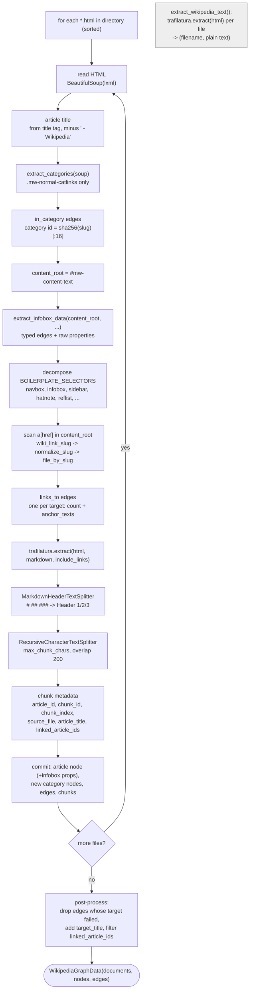
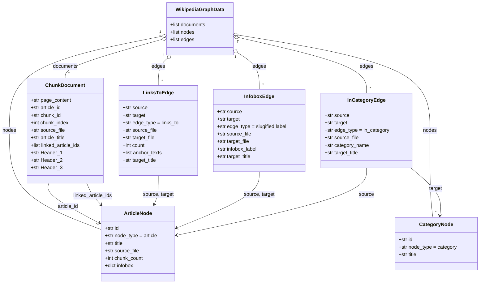

# `Extract_text_and_links_from_wikis.py` — Program Documentation

> **Documents:** `Capstone/Checkpoint 2.1/Extract_text_and_links_from_wikis.py`, 411 lines, last modified **2026-09-19 14:14**.
> **Documentation written:** 2026-09-22. Line numbers in the reference refer to that version.
>
> Diagrams use Mermaid (rendered natively on GitHub; VS Code needs the *Markdown Preview Mermaid Support* extension). The Checkpoint 4.1 evaluation script that consumes this module is documented in [capstone_checkpoint_4_1_advanced_retrieval_solution.md](capstone_checkpoint_4_1_advanced_retrieval_solution.md).

## Contents

1. [Purpose](#1-purpose)
2. [Usage](#2-usage)
3. [Program flow](#3-program-flow)
   - [3.1 Per-article pipeline](#31-per-article-pipeline)
   - [3.2 Data model](#32-data-model)
4. [Reference](#4-reference)
   - [4.1 Constants and the result container](#41-constants-and-the-result-container)
   - [4.2 Slug helpers](#42-slug-helpers)
   - [4.3 `extract_categories`](#43-extract_categories)
   - [4.4 `extract_infobox_data`](#44-extract_infobox_data)
   - [4.5 `extract_wikipedia_text`](#45-extract_wikipedia_text)
   - [4.6 `process_wikipedia_with_links`](#46-process_wikipedia_with_links)
   - [4.7 `process_wikipedia_with_nodes_and_edges`](#47-process_wikipedia_with_nodes_and_edges)
5. [Outputs and consumers](#5-outputs-and-consumers)
6. [Design notes and limitations](#6-design-notes-and-limitations)

---

## 1. Purpose

The module turns a directory of saved Wikipedia HTML pages into the three things the capstone's retrievers need:

| Entry point | Produces | Used by |
|---|---|---|
| `extract_wikipedia_text(dir)` | one plain-text string per article | the Checkpoint 2.1/3.1 whole-article baseline; `--retriever baseline` in 4.1 |
| `process_wikipedia_with_links(dir)` | LangChain `Document` chunks with metadata (article id, chunk id, section headers, linked article ids) | chunk-level retrieval (`--retriever chunks` / `decompose`) |
| `process_wikipedia_with_nodes_and_edges(dir)` | the chunks **plus** graph nodes (articles, categories) and typed edges (`links_to`, `in_category`, infobox relations) in a `WikipediaGraphData` container | the NetworkX graph retriever (`--retriever graph`); the 4.1 script caches this whole result to disk |

Text extraction is delegated to `trafilatura`; HTML structure (title, categories, infobox, body links) is read with BeautifulSoup/lxml; chunking uses LangChain's `MarkdownHeaderTextSplitter` and `RecursiveCharacterTextSplitter`. The module does not build a graph itself — it returns plain dict nodes and edges so the caller can load them into NetworkX (or anything else).

[↑ Back to contents](#contents)

---

## 2. Usage

```python
from Extract_text_and_links_from_wikis import (
    extract_wikipedia_text,
    process_wikipedia_with_links,
    process_wikipedia_with_nodes_and_edges,
)

WIKIPEDIA_DIR = "Capstone/Checkpoint 1.1/Wikipedia"

docs   = extract_wikipedia_text(WIKIPEDIA_DIR)             # [(filename, text), ...]
chunks = process_wikipedia_with_links(WIKIPEDIA_DIR)        # [Document, ...]
data   = process_wikipedia_with_nodes_and_edges(WIKIPEDIA_DIR, max_chunk_chars=2000)

import networkx as nx
graph = nx.DiGraph()
for node in data.nodes:
    graph.add_node(node["id"], **node)
for edge in data.edges:
    graph.add_edge(edge["source"], edge["target"], **edge)
```

Dependencies: `beautifulsoup4`, `lxml`, `trafilatura`, `langchain-core`, `langchain-text-splitters` (and `networkx` for the caller). On the full 2,419-article corpus the graph-building pass takes about 35 minutes and prints a progress line every 100 files; the 4.1 script caches its output (`wikipedia_chunks2000_cache/`) so it runs once.

[↑ Back to contents](#contents)

---

## 3. Program flow

### 3.1 Per-article pipeline

`process_wikipedia_with_nodes_and_edges()` runs this sequence for every `.html` file, in sorted filename order, inside a per-file `try` so one malformed page is skipped rather than aborting the run. `process_wikipedia_with_links()` is the same pipeline with only `.documents` returned; `extract_wikipedia_text()` is the single grey step on its own.



### 3.2 Data model

What the container holds. Node and edge records are plain dicts; chunks are LangChain `Document`s.



Identifiers: an article's `id` is `sha256(filename)[:16]`; a category's `id` is `sha256(category slug)[:16]`; a chunk's `chunk_id` is `<article_id>-c<chunk_index:05d>`. The `infobox` dict on an article node maps slugified row labels to the row's raw text (e.g. `former_names` → `"Harvard College"`) and is present only when the article has an infobox.

[↑ Back to contents](#contents)

---

## 4. Reference

### 4.1 Constants and the result container

| Name (line) | Value / shape | Meaning |
|---|---|---|
| `WikipediaGraphData` (56) | dataclass: `documents: list[Document]`, `nodes: list[dict]`, `edges: list[dict]` | Graph-ready content with no dependency on a graph library. |
| `BOILERPLATE_SELECTORS` (66) | `.navbox`, `.infobox`, `.sidebar`, `.hatnote`, `.reflist`, `.mw-editsection`, `.catlinks`, `.metadata`, `#toc` | Page furniture removed from `content_root` **before the body-link scan** (a navbox alone can add dozens of edges per article). Note the infobox is read by `extract_infobox_data()` *before* this removal. |
| `MARKDOWN_WIKI_LINK` (73) | regex over trafilatura's markdown: `](./Slug)` or `](/wiki/Slug)`, tolerating one level of parentheses in the slug and trailing `?…`/`#…` | Finds the wiki links inside each chunk's text to populate `linked_article_ids`. |

[↑ Back to contents](#contents)

### 4.2 Slug helpers

| Function (line) | Purpose | Inputs → Returns |
|---|---|---|
| `normalize_slug(name)` (78) | Make filenames and link targets comparable: percent-decode, spaces → `_`, case-fold. Applied to both sides of every lookup. | `str` → `str` |
| `wiki_link_slug(href)` (83) | The article slug an `<a href>` points to, or `None` for non-article links. Accepts saved-page links (`/wiki/Foo`) and Parsoid links (`./Foo`); rejects hosts outside `wikipedia.org`; strips nothing else (namespace prefixes such as `Category:` or `File:` stay in the slug, which is how `extract_categories` gets the category slug and how non-article links simply fail the `file_by_slug` lookup). | `str` → `str \| None` |
| `slugify_label(label)` (102) | Normalise an infobox row label into an edge/property key: `'Directed by'` → `directed_by`, `'Spouse(s)'` → `spouse_s`, `'Born'` → `born`. Light normalisation only — no controlled vocabulary, so near-synonymous labels from different templates stay distinct keys. | `str` → `str` |

[↑ Back to contents](#contents)

### 4.3 `extract_categories`

**`extract_categories(soup) -> list[(display name, slug)]`** (115)
Selects `.mw-normal-catlinks a[href^='/wiki/Category:']` — the real topical categories at the foot of the page — and returns each one's display text and link slug (e.g. `("Presidents of the United States", "Category:Presidents_of_the_United_States")`). Hidden/maintenance categories (`.mw-hidden-catlinks`, such as "Articles with short description" or "Use dmy dates from …") are deliberately excluded because they carry no topical meaning.
- **Inputs:** the whole-page `BeautifulSoup` (the category block sits outside `#mw-content-text`).
- **Returns:** list of `(name, slug)` tuples in page order; empty list if the page has none.

[↑ Back to contents](#contents)

### 4.4 `extract_infobox_data`

**`extract_infobox_data(content_root, article_id, filename, article_ids, file_by_slug) -> (edges, properties)`** (130)
Walks the article's `table.infobox` once (if present) and returns two things from the same pass:
- **`edges`** — one dict per `<a href>` inside a data cell that resolves to another corpus article: `{source, target, edge_type: <slugified row label>, source_file, target_file, infobox_label: <raw label>}`. One edge per *link*, not per row: a "Starring" row with five linked actors yields five `starring` edges. Self-links and targets outside the corpus are skipped.
- **`properties`** — a flat `{slugified label: raw cell text}` dict covering **every** labelled row, linked or not (e.g. `born`, `died`, `former_names`, `years_active`). No attempt is made to resolve unlinked names to articles; that is a deliberately deferred enhancement.
- **Inputs:** `content_root` (the `#mw-content-text` element, *before* boilerplate removal — the infobox is one of the selectors that removal deletes); the article's id and filename; `article_ids` (filename → id) and `file_by_slug` (normalised slug → filename) for target resolution.
- **Returns:** `([], {})` when the article has no infobox. Rows without both a `th.infobox-label` and a `td.infobox-data` (header rows, images) are ignored.

Measured on the full corpus: 1,984 of 2,419 articles carry infobox properties; the commonest edge types are `starring` (84), `country` (79), `location` (68), `labels` (63), `born` (57), `education` (40), `preceded_by` (29), `directed_by` (28), `succeeded_by` (21), `monarch` (22).

[↑ Back to contents](#contents)

### 4.5 `extract_wikipedia_text`

**`extract_wikipedia_text(directory_path) -> list[(filename, text)]`** (188)
For every `.html` file in the directory (sorted), reads the page and returns `trafilatura.extract(html)` — plain text of the main content, which in practice includes the infobox rendered as `Label | value` rows but drops navboxes and reference lists. Files where trafilatura returns nothing are omitted; a file that raises is reported with `Failed to extract <file>: <error>` and skipped.
- **Inputs:** directory path.
- **Returns:** `[(filename, text), …]`.
- **Side effects:** prints one line per failure; no caching (the 4.1 script re-runs it on every baseline invocation, several minutes on the full corpus).

[↑ Back to contents](#contents)

### 4.6 `process_wikipedia_with_links`

**`process_wikipedia_with_links(directory_path, max_chunk_chars=2000) -> list[Document]`** (210)
Convenience wrapper: runs `process_wikipedia_with_nodes_and_edges()` and returns only its `.documents`. Because it runs the full pipeline, it costs exactly as much as the graph build — callers that will also need the graph should call the full function once and keep both.

[↑ Back to contents](#contents)

### 4.7 `process_wikipedia_with_nodes_and_edges`

**`process_wikipedia_with_nodes_and_edges(directory_path, max_chunk_chars=2000) -> WikipediaGraphData`** (219)
The main pipeline of [3.1](#31-per-article-pipeline).

**Setup (before the loop)**
- `filenames` — sorted `.html` files; `article_ids` — `sha256(filename)[:16]` for each; `file_by_slug` — `normalize_slug(filename without .html)` → filename, the lookup that turns any link into a corpus file (or nothing).
- `category_ids` / `category_nodes_created` — categories are not known from a file listing; a category becomes a node the first time any article references it.
- `header_splitter` — `MarkdownHeaderTextSplitter` on `#`, `##`, `###` → metadata keys `Header 1/2/3`, `strip_headers=False` so the heading text stays inside the chunk for BM25 and embeddings. Because trafilatura emits the article title as `# Title`, **every chunk carries `Header 1`**; the lead section is the run of chunks with no `Header 2/3`.
- `text_splitter` — `RecursiveCharacterTextSplitter(chunk_size=max_chunk_chars, chunk_overlap=200, separators=["\n\n", "\n", " ", ""])`.

**Per file (inside `try`)**
1. Parse with `BeautifulSoup(html, "lxml")`; title from `<title>` minus ` - Wikipedia`, falling back to the filename.
2. `extract_categories(soup)` → one `in_category` edge per category `{source, target: category_id, edge_type: "in_category", source_file, category_name}`.
3. `content_root = soup.select_one("#mw-content-text") or soup`; `extract_infobox_data(...)` → infobox edges and properties. **Runs before step 4 by necessity.**
4. Decompose every `BOILERPLATE_SELECTORS` match inside `content_root`.
5. Scan every remaining `a[href]`: `wiki_link_slug` → `normalize_slug` → `file_by_slug`. Links that resolve to another corpus file become **one** `links_to` edge per target `{source, target, edge_type: "links_to", source_file, target_file, count, anchor_texts}`, with `count` incremented and distinct anchor texts collected on repeats. If a page yields no recognisable article links at all, a warning names it (unexpected HTML format).
6. `trafilatura.extract(html, output_format="markdown", include_links=True)`; raises `ValueError` (→ the file is skipped) if nothing is extracted.
7. Header split, then size split, then per-chunk metadata: `article_id`, `chunk_id`, `chunk_index`, `source_file`, `article_title`, `linked_article_ids` (article ids for the wiki links found in *that chunk's* markdown via `MARKDOWN_WIKI_LINK`, excluding the article itself).
8. **Commit** — only reached if everything above succeeded: append the article node (`{id, node_type: "article", title, source_file, chunk_count}` plus `infobox` when non-empty), any first-seen category nodes (`{id, node_type: "category", title}`), all three edge lists, and the chunks.

**Error handling and progress** — any exception inside the `try` increments `failures` and prints `Failed to process <file>: <error>`; the `finally` block prints `Progress: n/N files processed, k chunks produced, f failures` every 100 files and at the end.

**Post-processing (after the loop)**
- `title_by_id` from the nodes; edges whose `target` is not a known node (an article that failed, or was never in the corpus) are dropped; every surviving edge gains `target_title`.
- Each chunk's `linked_article_ids` is filtered to ids that exist as nodes.
- Returns `WikipediaGraphData(documents=all_chunks, nodes=nodes, edges=edges)`.

Full-corpus result (2,419 files, 0 failures, 2,086 s): 134,107 chunks; 28,054 nodes (2,419 articles + 25,635 categories); 56,761 edges (37,548 `in_category`, 17,517 `links_to`, ~1,700 infobox-typed).

[↑ Back to contents](#contents)

---

## 5. Outputs and consumers

| Output | Shape | Consumer |
|---|---|---|
| `extract_wikipedia_text()` result | `[(filename, plain text)]` | Whole-article BM25 + Chroma index (`Checkpoint 2.1/wikipedia_chroma_db`, `metadata.source` = filename); `validate_golden_suite.py` verifies golden quotes against the same trafilatura plain text. |
| `.documents` | `Document(page_content=markdown chunk, metadata={…})` | Chunk BM25 + Chroma index (`wikipedia_chunks2000_chroma_db`; list-valued `linked_article_ids` is joined to a string for Chroma); parent expansion uses `chunk_index` and `Header 1/2/3`. |
| `.nodes` / `.edges` | dicts as in [3.2](#32-data-model) | `WikipediaGraph` in the 4.1 script: category-title matching, category co-membership, typed-edge and link traversal. |
| Cached form | `wikipedia_chunks2000_cache/{chunks.jsonl, nodes.json, edges.json, manifest.json}` | Written once by the 4.1 script's `load_or_build_chunk_corpus()`; ~240 MB, ignored by git. |

[↑ Back to contents](#contents)

---

## 6. Design notes and limitations

- **Two text extractions, two texts.** Plain text (`extract_wikipedia_text`) and markdown (`process_wikipedia_with_nodes_and_edges`) come from the same trafilatura call with different output formats, and they differ in detail: markdown renders reference markers as `<sup>[\[4\]](…)</sup>`, keeps link targets, and shifts spaces around link boundaries. Anything that matches quotes across the two (evidence recall, quote fidelity in 4.1) must normalise for that; the 4.1 script does so by stripping links and superscripts and comparing whitespace-free.
- **Navboxes are dropped everywhere.** Trafilatura excludes them from both text formats, and `BOILERPLATE_SELECTORS` removes them before the link scan, so facts that exist only in a navbox (e.g. the list of Northern Ireland councils on `Belfast.html`) are unreachable by any retriever. A `navbox_member` edge type is the obvious extension; it is a documented limitation for now.
- **The infobox is read, then removed.** `extract_infobox_data` must run before the boilerplate decompose — ordering is enforced in the code and commented there. Infobox links therefore appear as *typed* edges (`education`, `mother`, …) and never as generic `links_to` edges.
- **Hidden categories are excluded on purpose.** Only `.mw-normal-catlinks` are read; maintenance categories would otherwise create tens of thousands of meaningless co-membership edges.
- **Unlinked infobox values are properties, not edges.** "Produced by Jan Blenkin" with no wikilink stays as text on the node; resolving such names to articles (alias matching against corpus titles) is deferred.
- **Light label slugification.** `'Produced by'` and `'Production by'` become different keys; a controlled vocabulary should be derived from the labels that actually occur across the corpus before graph queries rely on exact edge types.
- **One `links_to` edge per (source, target).** Repeated links are counted, not duplicated; `anchor_texts` preserves how the target was referred to.
- **Per-article failure isolation.** A page that fails at any step contributes nothing (no node, no edges, no chunks) rather than a partial record, which is why edges to failed targets are pruned afterwards.
- **Cost.** The BeautifulSoup parse plus trafilatura call dominates (~0.85 s per article, ~35 min for the corpus); `process_wikipedia_with_links` pays it in full even though it discards the graph.

[↑ Back to contents](#contents)
