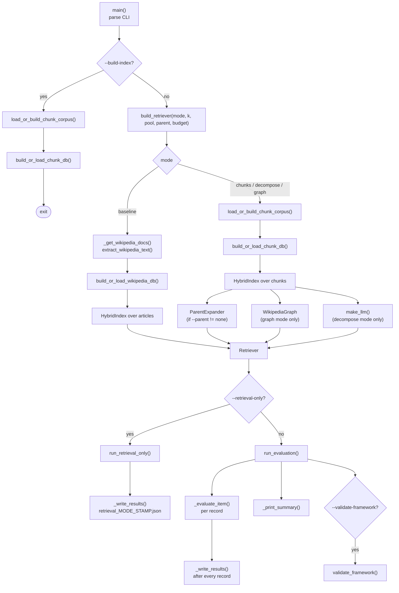
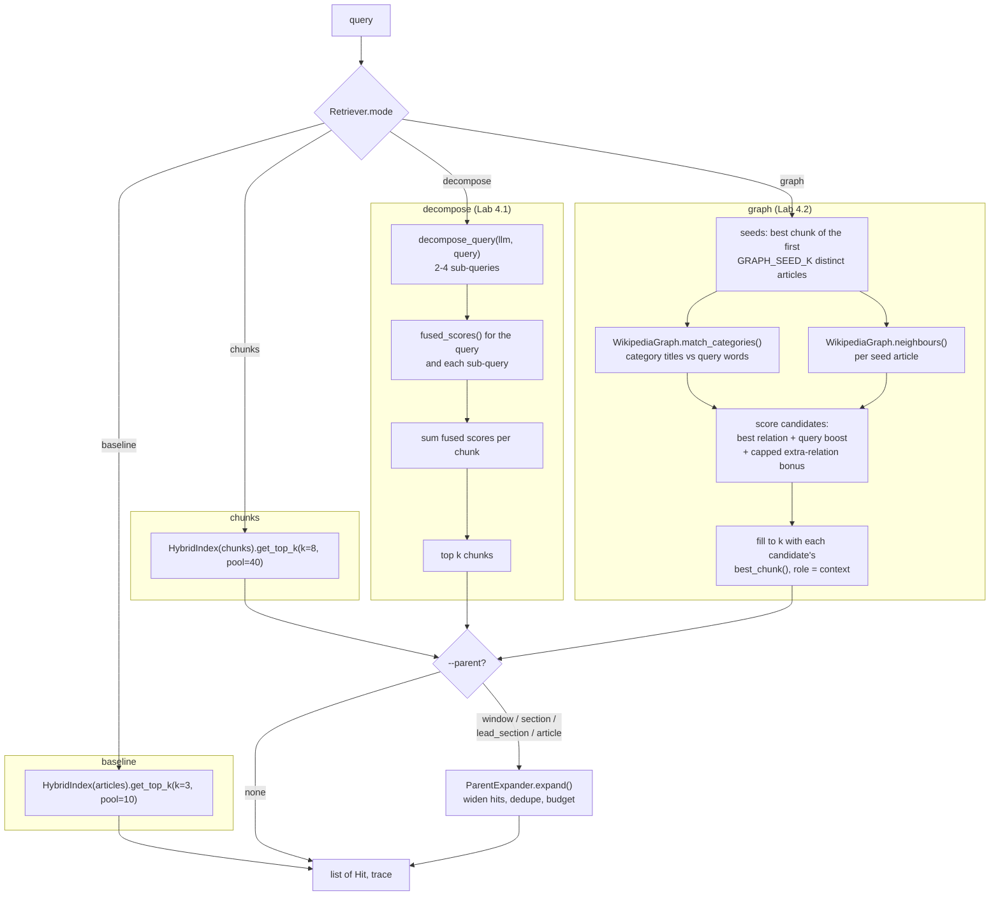
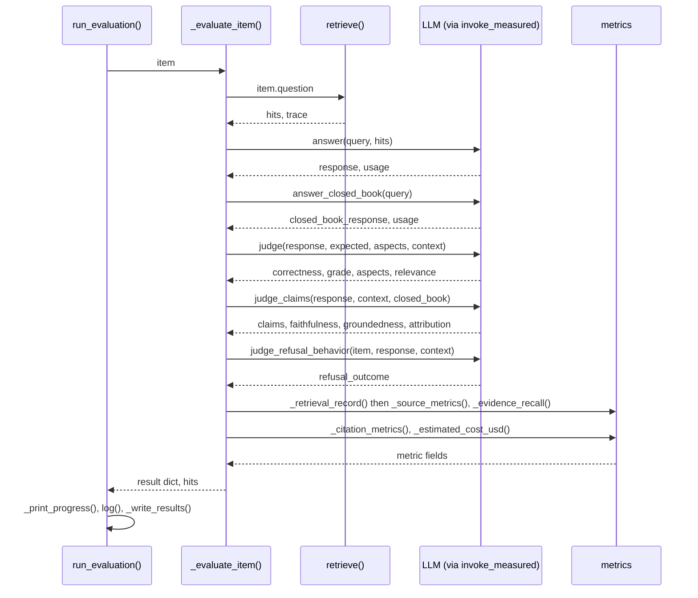
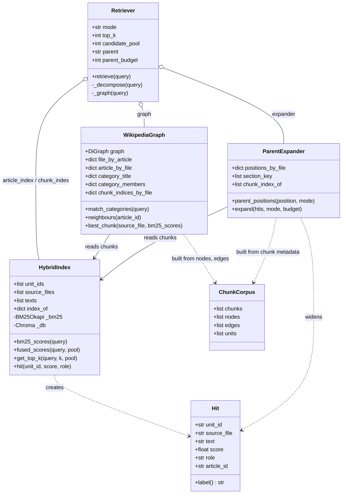

# `capstone_checkpoint_4_1_advanced_retrieval_solution.py` — Program Documentation

> **Documents:** `Capstone/Checkpoint 4.1/capstone_checkpoint_4_1_advanced_retrieval_solution.py`, 1,789 lines, last modified **2026-09-21 18:31**.
> **Documentation written:** 2026-09-22. If the script's modification date is later than this, the reference below may lag the code — the line numbers in the reference tables are the quickest way to check.
>
> Diagrams use Mermaid. They render natively on GitHub; in VS Code's Markdown preview they need the *Markdown Preview Mermaid Support* extension.

## Contents

1. [Purpose](#1-purpose)
2. [Running the script](#2-running-the-script)
3. [Program flow](#3-program-flow)
   - [3.1 Top-level pipeline](#31-top-level-pipeline)
   - [3.2 Retrieval strategies](#32-retrieval-strategies)
   - [3.3 One evaluation record](#33-one-evaluation-record)
   - [3.4 Classes and what they hold](#34-classes-and-what-they-hold)
4. [Reference](#4-reference)
   - [4.1 Configuration constants](#41-configuration-constants)
   - [4.2 Setup and LLM access](#42-setup-and-llm-access)
   - [4.3 Retrieval units and text helpers](#43-retrieval-units-and-text-helpers)
   - [4.4 `HybridIndex`](#44-hybridindex)
   - [4.5 Baseline corpus (whole articles)](#45-baseline-corpus-whole-articles)
   - [4.6 Chunk corpus and chunk index](#46-chunk-corpus-and-chunk-index)
   - [4.7 `WikipediaGraph`](#47-wikipediagraph)
   - [4.8 `ParentExpander`](#48-parentexpander)
   - [4.9 `Retriever` and the retrieval switch](#49-retriever-and-the-retrieval-switch)
   - [4.10 Generation](#410-generation)
   - [4.11 LLM judges](#411-llm-judges)
   - [4.12 Golden suite loading](#412-golden-suite-loading)
   - [4.13 Deterministic metrics](#413-deterministic-metrics)
   - [4.14 Runner, reporting and CLI](#414-runner-reporting-and-cli)
5. [Data artifacts](#5-data-artifacts)
6. [Design notes](#6-design-notes)

---

## 1. Purpose

The script is the Checkpoint 4.1 evaluation harness for the Wikipedia RAG capstone. It was built by copying the Checkpoint 3.1 evaluation script — golden-suite loader, three LLM judges and deterministic metrics carried over verbatim — and adding a **retrieval switch** (`--retriever`) so that four retrieval strategies can be scored by exactly the same instruments on exactly the same records:

| Strategy | Retrieval unit | Index | Technique |
|---|---|---|---|
| `baseline` | whole article | Checkpoint 2.1 whole-article Chroma DB | BM25 + vector fusion, `TOP_K=3` (the 3.1 baseline, reproduced byte-for-byte) |
| `chunks` | text chunk (≤2,000 chars) | chunk Chroma DB built by this script | the same fusion over section- and size-split chunks, `TOP_K=8` |
| `decompose` | text chunk | chunk Chroma DB | Lab 4.1: LLM query decomposition into sub-queries, per-chunk score summing |
| `graph` | text chunk | chunk Chroma DB + NetworkX graph | Lab 4.2: seed articles, then expansion through category, infobox and hyperlink edges with primary/context labelling |

All chunk strategies can additionally widen each hit to a **parent** (`--parent`): its neighbouring chunks, its section, its section plus the article lead/infobox, or the whole article.

Everything upstream of retrieval — HTML parsing, chunking, node/edge extraction — lives in `Checkpoint 2.1/Extract_text_and_links_from_wikis.py`; this script imports two functions from it (`extract_wikipedia_text`, `process_wikipedia_with_nodes_and_edges`) and caches their output.

[↑ Back to contents](#contents)

---

## 2. Running the script

```
python capstone_checkpoint_4_1_advanced_retrieval_solution.py [options]
```

| Option | Values / default | Effect |
|---|---|---|
| `--retriever` | `baseline` (default), `chunks`, `decompose`, `graph` | Retrieval strategy. Chunk strategies build or load the chunk cache and chunk index on first use. |
| `--parent` | `none` (default), `window`, `section`, `lead_section`, `article` | Parent-child expansion for chunk strategies (error with `baseline`). |
| `--parent-budget` | int, default 40,000 | Total context budget in characters when `--parent` is used. |
| `--k` | int | Units to retrieve; default 3 for `baseline`, 8 otherwise. |
| `--pool` | int | Fusion candidate pool; default 10 for `baseline`, 40 otherwise. |
| `--input` | path, default `golden_suite_4.1.json` | Golden-suite JSON to evaluate. |
| `--limit` | int ≥ 1 | Evaluate only the first N records (smoke test). |
| `--output` | path | Results JSON path (default: timestamped file in `evaluation_results/`). |
| `--build-index` | flag | Build the chunk cache and chunk vector index, then exit. Resumable. |
| `--retrieval-only` | flag | Retrieve for every record without calling the answer model or judges (no LLM cost); writes `retrieval_<mode>_<stamp>.json`. |
| `--compare-to` | path | With `--retrieval-only`: an earlier results JSON whose `retrieved_sources` are compared record by record. |
| `--validate-framework` | flag | After evaluation, check that the judge passes a correct answer and fails a manipulated one. |

Typical sequence:

```
# one-off, ~35 min parse + ~30 min embedding, resumable
python ...solution.py --build-index

# free: check what a configuration retrieves before spending judge calls
python ...solution.py --retriever graph --parent lead_section --retrieval-only --input mini-4.1-test-suite.json

# paid: full evaluation
python ...solution.py --retriever graph --parent lead_section --parent-budget 60000 --input mini-4.1-test-suite.json
```

Environment: `OPENROUTER_API_KEY` from a `.env` found by walking up from the script's directory (falls back to `Checkpoint 3.1/.env`); optional `OPENROUTER_INPUT_USD_PER_MILLION` / `OPENROUTER_OUTPUT_USD_PER_MILLION` for cost estimates.

[↑ Back to contents](#contents)

---

## 3. Program flow

### 3.1 Top-level pipeline

`main()` parses the CLI, `build_retriever()` assembles the indexes the chosen strategy needs, and then one of three runners executes.



### 3.2 Retrieval strategies

Every strategy sits behind `Retriever.retrieve(query) -> (list[Hit], trace)`. The module-level `retrieve()` forwards to the configured instance.



### 3.3 One evaluation record

`_evaluate_item()` makes five paced LLM calls per record (six under `decompose`, which also calls the model for the sub-queries) and computes every deterministic metric.



### 3.4 Classes and what they hold



[↑ Back to contents](#contents)

---

## 4. Reference

Conventions: **Inputs** lists parameters with their meaning; **Returns** gives the shape of the result; **Side effects** covers files written, LLM calls and global state. Line numbers refer to the script version stamped at the top of this page. Names beginning with an underscore are private helpers and are listed in compact tables.

### 4.1 Configuration constants

| Constant (line) | Value | Meaning |
|---|---|---|
| `LLM_MODEL`, `EMBEDDING_MODEL` (71–72) | `openai/gpt-5.4-mini`, `openai/text-embedding-3-small` | Models, both via OpenRouter. |
| `TEMPERATURE` (73) | 0.2 | Chat sampling temperature. |
| `MAX_OUTPUT_TOKENS` (77) | 4096 | Output cap on every chat call; OpenRouter reserves the model's full default allowance when checking affordability, so an uncapped call is refused on a low balance. |
| `LLM_MIN_INTERVAL_SECONDS`, `LLM_MAX_RETRIES` (80–81) | 3.1 s, 6 | Pacing and 429 retries (new accounts are limited to 20 requests/minute). |
| `WEIGHT_BM25`, `WEIGHT_VECTOR` (82–83) | 0.5 / 0.5 | Fusion weights. |
| `MAX_CHUNK_CHARS` (84) | 2000 | Chunk size passed to the 2.1 chunker; also names the cache and index directories. |
| `RETRIEVER_CONFIGS` (89) | per-strategy `top_k`, `candidate_pool`, `unit` | Defaults overridable with `--k` / `--pool`. |
| `GRAPH_*` (97–109) | see table in [4.9](#49-retriever-and-the-retrieval-switch) | Graph traversal knobs. |
| `INDEX_BATCH_SIZE` (110) | 1000 | Chunks per Chroma insert. |
| `PARENT_MODES`, `PARENT_MAX_CHUNKS`, `LEAD_MAX_CHUNKS`, `PARENT_MAX_CONTEXT_CHARS` (117–124) | see [4.8](#48-parentexpander) | Parent expansion knobs. |
| Paths (126–134) | `WIKIPEDIA_DIR`, `WIKIPEDIA_CHROMA_DIR`, `CHUNK_CACHE_DIR`, `CHUNK_CHROMA_DIR`, `GOLDEN_SUITE_PATH`, `RESULTS_DIR`, `LOG_PATH` | Corpus, index, cache, suite and output locations, all relative to the script. |
| Prompts (138–162) | `DECOMPOSE_SYSTEM`, `ANSWER_SYSTEM`, `CLOSED_BOOK_SYSTEM`, `JUDGE_SYSTEM` | System prompts. `ANSWER_SYSTEM` explains the `(context: …)` labels and the `[filename.html]` citation convention. |
| `STOPWORDS` (166) | set | Words ignored when matching query words against category titles and neighbour titles. |

[↑ Back to contents](#contents)

### 4.2 Setup and LLM access

**`check_api_key() -> str`** (177)
Loads `.env` (walking up from the script; falls back to `Checkpoint 3.1/.env`) and returns `OPENROUTER_API_KEY`. **Raises** `RuntimeError` if unset.

**`make_llm() -> ChatOpenAI`** (192) — chat model with `MAX_OUTPUT_TOKENS`. **`get_embeddings() -> OpenAIEmbeddings`** (202) — embedding model. Both call `check_api_key()`.

**`invoke_measured(llm, messages) -> (text, usage)`** (992)
The single gateway for every chat call. Sleeps so that consecutive calls are ≥ `LLM_MIN_INTERVAL_SECONDS` apart, retries rate-limit errors with exponential backoff (10 s → 90 s, up to `LLM_MAX_RETRIES`), and measures the successful attempt.
- **Inputs:** `llm`; `messages` (system + human).
- **Returns:** the response text; `usage` = `{input_tokens, output_tokens, total_tokens, latency_seconds, throttle_seconds}` — latency covers only the successful attempt, throttle the time spent pacing and backing off.
- **Side effects:** updates the module-level `_last_llm_call` timestamp; prints a line on each retry.

| Helper (line) | Purpose | Inputs → Returns |
|---|---|---|
| `log(label, text)` (210) | Append a timestamped entry to `LOG_PATH` (`checkpoint_4_1_evaluation.log` in the working directory). | strings → `None`; writes file |
| `_message_text(response)` (954) | Flatten a LangChain response's `content` (string or list of blocks) to text. | response → `str` |
| `_token_usage(response)` (966) | Read token counts from `usage_metadata` or `response_metadata`. | response → `{input_tokens, output_tokens, total_tokens}` |
| `_is_rate_limit(error)` (987) | True for HTTP 429 or a message containing "rate limit". | `Exception` → `bool` |
| `_json_object(text)` (1025) | Parse a judge reply as a JSON object, stripping code fences and tolerating surrounding prose. | `str` → `dict`; raises `ValueError` if no object |

[↑ Back to contents](#contents)

### 4.3 Retrieval units and text helpers

**`class Hit`** (225) — dataclass, the unit every strategy returns.

| Field | Meaning |
|---|---|
| `unit_id` | filename (baseline), chunk id (chunk strategies), or `file#cAAAAA-cBBBBB` for a parent spanning several chunks |
| `source_file` | article filename — what citations, recall and precision use |
| `text` | the text handed to the model |
| `score` | fused retrieval score (or graph candidate score) |
| `role` | `"primary"` or `"context: <relation>"` (graph expansions) |
| `article_id` | graph node id when known |
| `label` (property) | `[file]` for primary hits, `[file] (context: …)` otherwise — the prefix used in the prompt |

| Helper (line) | Purpose | Inputs → Returns |
|---|---|---|
| `_tokens(text)` (240) | Lower-case alphanumeric tokens for BM25 and matching. | `str` → `list[str]` |
| `_stem(token)` (244) | Minimal plural stripping (`presidents`→`president`, `centuries`→`century`). | `str` → `str` |
| `_content_tokens(text)` (254) | Stemmed tokens minus `STOPWORDS`; used for category and neighbour matching. | `str` → `set[str]` |
| `_normalize(scores, invert=False)` (258) | Min–max scale a score list to 0–1; `invert` for distances. All-equal lists become 0.5. | `list[float]` → `list[float]` |
| `_display_text(markdown)` (274) | Strip `[text](./slug)` wiki links to their anchor text (handles one level of parentheses in slugs; linear-time pattern). | `str` → `str` |

[↑ Back to contents](#contents)

### 4.4 `HybridIndex`

**`class HybridIndex(units, db, metadata_id_key)`** (284)
BM25 + Chroma fusion over arbitrary units, keyed by unit id so several chunks of one article never collapse into one entry. Used twice: over whole articles (baseline; `metadata_id_key="source"`) and over chunks (`"chunk_id"`).

- **Inputs:** `units` — list of `(unit_id, source_file, text)`; `db` — a loaded Chroma collection whose documents carry the unit id under `metadata_id_key`.
- **State:** `unit_ids`, `source_files`, `texts` (parallel lists), `index_of` (unit id → position), a `BM25Okapi` built over `_tokens(text)`.
- **Cost:** building BM25 over 134k chunks takes a few minutes and ~1–2 GB.

| Method (line) | Purpose | Inputs → Returns |
|---|---|---|
| `bm25_scores(query)` (302) | BM25 score of every unit (used by the graph to pick an article's best chunk). | `str` → `list[float]` |
| `_bm25_top_k(query, k)` (305) | Top-k units by BM25. | → `list[(unit_id, score)]` |
| `_vector_top_k(query, k)` (310) | Top-k units by Chroma similarity (returns distances). | → `list[(unit_id, distance)]` |
| `fused_scores(query, pool)` (317) | Union of the two top-`pool` lists, each min–max normalised (distances inverted), combined with `WEIGHT_BM25`/`WEIGHT_VECTOR`, best first. | → `list[(unit_id, fused 0–1)]` |
| `hit(unit_id, score, role="primary")` (343) | Materialise a `Hit`. | → `Hit` |
| `get_top_k(query, k, pool)` (347) | `fused_scores()` truncated to `k`, as `Hit`s. | → `list[Hit]` |

[↑ Back to contents](#contents)

### 4.5 Baseline corpus (whole articles)

**`_get_wikipedia_docs() -> list[(filename, text)]`** (358)
Lazily calls `extract_wikipedia_text(WIKIPEDIA_DIR)` (trafilatura plain text per article) and caches the result in the module-level `_wikipedia_docs`. Takes several minutes on the full corpus; nothing is cached to disk.

**`build_or_load_wikipedia_db() -> Chroma`** (365)
Loads the Checkpoint 2.1 whole-article Chroma DB from `WIKIPEDIA_CHROMA_DIR` if present, otherwise embeds every article (`metadata={"source": filename}`) into it. Never touched by the chunk strategies.

[↑ Back to contents](#contents)

### 4.6 Chunk corpus and chunk index

**`class ChunkCorpus`** (389) — dataclass: `chunks` (list of `{"page_content", "metadata"}`), `nodes`, `edges` (the 2.1 graph data as plain dicts) and `units` (`(chunk_id, source_file, display text)` triples for `HybridIndex`).

**`load_or_build_chunk_corpus() -> ChunkCorpus`** (396)
- If `CHUNK_CACHE_DIR/manifest.json` exists: loads `chunks.jsonl`, `nodes.json`, `edges.json`.
- Otherwise runs `process_wikipedia_with_nodes_and_edges(WIKIPEDIA_DIR, MAX_CHUNK_CHARS)` (~35 minutes on the full corpus) and writes those files plus the manifest (`chunk_count`, `node_count`, `edge_count`, `build_seconds`, …).
- Either way builds `units` with `_display_text()` applied to each chunk.
- **Side effects:** writes the cache on first run; prints progress.

**`build_or_load_chunk_db(corpus) -> Chroma`** (460)
Opens the chunk Chroma DB at `CHUNK_CHROMA_DIR`. If `index_complete.json` is absent, adds documents in batches of `INDEX_BATCH_SIZE`, **resuming** from the number already present (rounded down to a batch boundary); metadata is passed through `_scalar_metadata()`; ids are chunk ids. Writes the completion marker when done.
- **Inputs:** a `ChunkCorpus`.
- **Returns:** the Chroma collection.
- **Side effects:** embedding calls (~134k chunks ≈ 35M tokens on first build), files under `CHUNK_CHROMA_DIR`, progress lines every batch.

| Helper (line) | Purpose | Inputs → Returns |
|---|---|---|
| `_scalar_metadata(metadata)` (445) | Chroma accepts only scalar metadata: drops `None`, joins lists (`linked_article_ids`) with commas, stringifies anything else. | `dict` → `dict` |

[↑ Back to contents](#contents)

### 4.7 `WikipediaGraph`

**`class WikipediaGraph(corpus, index)`** (504)
Builds a `networkx.DiGraph` from the cached nodes (articles and categories) and edges (`links_to`, `in_category`, typed infobox edges such as `education`, `mother`, `succeeded_by`), plus the lookups the traversal needs.

- **State:** `graph`; `file_by_article` / `article_by_file` (node id ↔ filename); `category_title`; `category_members` (category id → member article ids); `chunk_indices_by_file` (filename → chunk positions in the index); a BM25 over stemmed category titles.
- **Size on the full corpus:** 28,054 nodes, 56,761 edges.

| Method (line) | Purpose | Inputs → Returns |
|---|---|---|
| `match_categories(query)` (533) | Categories whose titles share ≥ `GRAPH_CATEGORY_MIN_OVERLAP` content words with the query, among the top 40 by BM25, excluding empty and catch-all (> `GRAPH_MAX_CATEGORY_SIZE`) categories; ranked by overlap first, then BM25; top `GRAPH_CATEGORY_MATCH_TOP`. Example: "president … 20th … 21st century" → the two presidents-by-century categories. | `str` → `list[(category_id, overlap)]` |
| `neighbours(article_id)` (555) | One relation per edge of the article: co-members of each (non-catch-all) category → `("category", "shares category 'X' with <seed>")`; out-links → `("link", "linked from <seed>")`; infobox out-edges → `("infobox", "'Label' of <seed>")`; infobox in-edges → `("infobox", "<seed> is 'Label' of <other>")`. | `str` → `list[(neighbour_id, kind, description)]` |
| `best_chunk(source_file, bm25_scores)` (582) | The article's chunk with the highest BM25 score for the query, falling back to its first (lead/infobox) chunk when nothing overlaps. | → `(position, score)`; `(-1, 0.0)` if the file has no chunks |

[↑ Back to contents](#contents)

### 4.8 `ParentExpander`

**`class ParentExpander(corpus, index)`** (596)
"Search small, read big": widens chunk hits to a larger parent read straight from the cached chunks — nothing is re-parsed or re-embedded.

- **State:** `positions_by_file` (filename → chunk positions in `chunk_index` order), `section_key` per position (`Header 1/2/3` from the chunk metadata; the article title is always `Header 1`, so the lead is "no Header 2/3"), `chunk_index_of`.
- **Knobs:** `PARENT_MAX_CHUNKS` = window 3, section 5, lead_section 4 (section part), article unbounded; `LEAD_MAX_CHUNKS` = 3; `PARENT_MAX_CONTEXT_CHARS` = 40,000.

| Method (line) | Purpose | Inputs → Returns |
|---|---|---|
| `_section_span(positions, i, cap)` (614) | Positions of the section containing `positions[i]`, at most `cap` of them centred on the hit. | → `list[int]` |
| `parent_positions(position, mode)` (629) | `window`: hit ± 1; `section`: `_section_span`; `lead_section`: first ≤3 lead chunks ∪ section span (≤4), in chunk order; `article`: every chunk of the file. | → `list[int]` |
| `expand(hits, mode, budget)` (647) | For each hit in rank order: skip it if its chunk is already inside an earlier parent; otherwise take its parent minus already-covered chunks, join the texts, and emit one `Hit` (`unit_id = file#cAAAAA-cBBBBB` when more than one chunk). A parent that would exceed the remaining `budget` falls back to the child chunk; when even that does not fit, expansion stops. Hits whose `unit_id` is not a chunk (already-expanded units) pass through unchanged. | `list[Hit]`, mode, budget → `list[Hit]` |

Measured effect on the 17-record mini suite (retrieval only, evidence recall / mean context): none 42% / 8k, window 46% / 20k, section 47.5% / 23k, lead_section 49.6% / 29k, article (120k budget) 43% / 86k.

[↑ Back to contents](#contents)

### 4.9 `Retriever` and the retrieval switch

**`class Retriever`** (679) — dataclass holding the configuration (`mode`, `top_k`, `candidate_pool`, `parent`, `parent_budget`) and the components the mode needs (`article_index`, `chunk_index`, `graph`, `expander`, `llm`).

**`Retriever.retrieve(query) -> (hits, trace)`** (691)
Dispatches on `mode`, then applies `ParentExpander.expand()` when `parent != "none"`. `trace` is a dict of diagnostics: `{}` for baseline/chunks; `{"sub_queries": [...]}` for decompose; `{"seed_files", "matched_categories", "candidate_count", "expansions"}` for graph; plus `{"child_chunk_ids", "parent_units"}` whenever parents were applied.

**`Retriever._decompose(query)`** (709)
Lab 4.1. Calls `decompose_query()`, then runs `chunk_index.fused_scores()` for the original query and every distinct sub-query and **sums** each chunk's fused scores across passes; returns the top `top_k` chunks. A chunk relevant to several sub-queries rises.

**`Retriever._graph(query)`** (721)
Lab 4.2 over the real schema, in five steps:
1. **Seeds** — walk the fused ranking and take the best chunk of each of the first `GRAPH_SEED_K` distinct articles (role `primary`).
2. **Category matching** — `match_categories()`; each member article becomes a candidate with weight `category_match × min(number of matched categories it belongs to, GRAPH_CATEGORY_MATCH_CAP)`, so an article in the *intersection* of two matched categories outranks one in either alone.
3. **Neighbour expansion** — `neighbours()` of every seed article, weighted by kind (`GRAPH_RELATION_WEIGHTS`: category_match 4, infobox 3, category 2, link 1).
4. **Scoring** — a candidate scores its *best* relation weight, plus `GRAPH_QUERY_BOOST` (2.0) if its title or the infobox label shares a content word with the query, plus `GRAPH_EXTRA_RELATION_BONUS` (0.5) per additional relation up to `GRAPH_EXTRA_RELATION_CAP` (4), plus 0.01 × the BM25 score of its best chunk as a tie-break. (Summing every shared category was tried first and let an article with twelve incidental categories in common outrank the one relevant typed edge.)
5. **Fill** — add each remaining candidate's `best_chunk()` in score order, role `context: <relations>`, until `top_k` units.
- **Returns:** hits and the trace described above.

**`decompose_query(llm, query) -> list[str]`** (826)
Asks the model for 2–4 sub-queries as a JSON array (`DECOMPOSE_SYSTEM`). Strips code fences, parses the first JSON value from the opening bracket with `raw_decode` (robust to trailing prose), and falls back to `[query]` on any error so retrieval degrades to plain hybrid search rather than crashing. **Side effects:** one paced LLM call.

**`build_retriever(mode, top_k=None, candidate_pool=None, parent="none", parent_budget=…) -> Retriever`** (848)
Assembles the components: baseline → whole-article docs + DB + `HybridIndex`; chunk modes → chunk corpus + chunk DB + `HybridIndex`, plus `ParentExpander` when a parent is requested, `WikipediaGraph` for graph mode, and an LLM for decompose mode. **Raises** `ValueError` if `--parent` is combined with `baseline`. Prints build progress.

**`retrieve(query) -> (hits, trace)`** (891) — module-level seam used by the runners; forwards to the global `_retriever` set by `main()`. **Raises** `RuntimeError` if no retriever has been built.

| Helper (line) | Purpose | Inputs → Returns |
|---|---|---|
| `_format_context(hits)` (898) | Join `hit.label + text` with blank lines — the "Documents:" block of the prompt and the context shown to the judges. | `list[Hit]` → `str` |

[↑ Back to contents](#contents)

### 4.10 Generation

**`answer(llm, query, hits) -> (text, usage)`** (902) — the RAG answer: `ANSWER_SYSTEM` plus `Documents:\n<context>\n\nQuestion: <query>`.

**`answer_closed_book(llm, query) -> (text, usage)`** (910) — the same question with no documents (`CLOSED_BOOK_SYSTEM`). Used as the reference for chunk attribution: a grounded claim the model also produces here came from training data, not retrieval.

**`my_advanced_plan() -> dict`** (926) — the Checkpoint 4.1 worksheet's Step 4 plan as data: `technique`, `node_types`, `edge_types`, `test_queries`, `rationale`.

[↑ Back to contents](#contents)

### 4.11 LLM judges

Carried over unchanged from Checkpoint 3.1. Each takes the answer and the retrieved context, returns a parsed JSON verdict plus `usage`, and is invoked through `invoke_measured()`.

**`judge(llm, answer_text, expected_answer, required_aspects, retrieved_context)`** (1041)
- **Returns:** `{correctness: "pass"|"fail", graded_correctness: complete|substantially_complete|partial|incorrect, graded_correctness_score: 1.0/0.75/0.5/0.0, covered_aspects: [indices], aspect_coverage: fraction, answer_relevance: "pass"|"fail"}`. Invalid values are coerced to the failing level.

**`judge_claims(llm, answer_text, retrieved_context, closed_book_answer)`** (1099)
Decomposes the answer into claims and judges each for `grounded` (supported by any retrieved document), `citation_supported` (supported by the *specific* `[file]` cited), and `attributable_to_retrieval` (absent from the closed-book answer).
- **Returns:** `{claims: [...], claim_count, graded_groundedness_score, faithfulness: pass iff every claim grounded, citation_support_rate, chunk_attribution_score}` (`None` where undefined).

**`judge_refusal_behavior(llm, item, answer_text, retrieved_context)`** (1186)
- **Returns:** `"appropriate_refusal" | "over_refusal" | "hallucinated"`, relabelled to `"n/a"` when the record is answerable, non-adversarial and the judge said the response behaved appropriately (nothing was being refused).

Known quirks (documented in the evaluation reports): honest "the documents do not say X" statements are marked ungrounded; `hallucinated` is frequently applied to grounded-but-incomplete answers.

[↑ Back to contents](#contents)

### 4.12 Golden suite loading

**`my_eval_set(path=GOLDEN_SUITE_PATH) -> list[dict]`** (1243)
Loads the JSON (`{"queries": [...]}` or a bare list) and adds the harness fields to each record in place: `question` (from `query`), `grading_notes` (= `expected_answer`), `expected_sources` (= `relevant_files`), `required_sources` (= `required_files`, else `expected_sources`), `required_aspects` (from the record, else split from the expected answer), `supporting_quotes` (default `[]`). Any other record fields (`group`, `source_suite`, `mechanism`, …) are preserved. **Raises** `ValueError` on an empty suite or a record with no query.

| Helper (line) | Purpose | Inputs → Returns |
|---|---|---|
| `_required_aspects(expected_answer)` (1233) | Split an expected answer into sentence/clause-sized aspects for suites that lack the field. | `str` → `list[str]` |

[↑ Back to contents](#contents)

### 4.13 Deterministic metrics

**`_source_metrics(required_sources, relevant_sources, hits) -> dict`** (1272)
Recall against the *required* articles over the set of unique retrieved articles; precision against the broader *relevant* set at both unit and article level.
- **Returns:** `source_hit_at_k` (any required article retrieved), `source_recall_at_k`, `source_recall_at_3_articles` (recall over the first three unique articles in rank order — the matched-count comparison with the 3-article baseline), `source_precision_at_k` and `chunk_precision_at_k` (identical: on-topic units / units), `article_precision` (on-topic unique articles / unique articles), `unique_articles_retrieved`, `source_recall_strict` (1.0 iff every required article retrieved), `all_required_present`.

**`_evidence_recall(supporting_quotes, hits) -> float | None`** (1345)
Fraction of the record's golden quotes present verbatim in the retrieved context under `_normalize_for_match()`. Distinguishes "retrieved the right article" from "retrieved the passage that answers the question". `None` when the record has no quotes.

**`_citation_metrics(response, hits, expected_sources) -> dict`** (1356)
Parses `[filename.html]` markers and quoted spans (≥10 characters) from the answer. Retrieved text is concatenated **per article** before matching, so several chunks of one article count as one document.
- **Returns:** `response_quote_count`, `quote_fidelity_rate` (quotes found verbatim in the retrieved text), `quote_attribution_accuracy` (found *and* the nearest preceding citation names a file containing it), `citation_count`, `citation_precision` (cited files ∩ expected / cited), `unsupported_citation_rate` (cited files never retrieved / cited).

| Helper (line) | Purpose | Inputs → Returns |
|---|---|---|
| `_unique_files(hits)` (1268) | Distinct `source_file`s in rank order. | `list[Hit]` → `list[str]` |
| `_normalize_evidence(text)` (1321) | Legacy normalisation (NFKC, curly quotes, whitespace); kept for compatibility. | `str` → `str` |
| `_normalize_for_match(text)` (1329) | Matching normalisation shared by evidence recall and quote fidelity: strips `<sup>` reference blocks, escaped brackets, wiki links, `[4]`-style citations and markdown symbols; applies the validator's punctuation map; NFKC; case-folds; **removes all whitespace** (trafilatura's markdown shifts spaces around link boundaries). | `str` → `str` |
| `_estimated_cost_usd(input_tokens, output_tokens)` (1412) | Cost from the two `OPENROUTER_*_USD_PER_MILLION` environment variables; `None` if unset. | ints → `float \| None` |

[↑ Back to contents](#contents)

### 4.14 Runner, reporting and CLI

**`_retrieval_record(item, hits, trace, seconds) -> dict`** (1426)
The retrieval part of a result, shared by evaluation and retrieval-only runs: `retrieved_sources` (unique files in rank order), `retrieved_units` (`unit_id`, `source_file`, `role`, `score` per hit), `unit_count`, `context_chars`, `evidence_recall`, `retrieval_trace`, `retrieval_latency_seconds`, plus every `_source_metrics()` field.

**`_evaluate_item(llm, item) -> (result, hits)`** (1442)
Retrieve → answer → closed-book answer → three judges → citation metrics → cost. The result dict contains the record's identifying fields (`id`, `question`, `retriever`, `group`, `source_suite`, `mechanism`, taxonomy fields, `answerable`, `adversarial_kind`, `required_sources`, `expected_sources`, `required_aspects`), the retrieval record, `response`, `closed_book_response`, all judge fields, all citation fields, `refusal_outcome`, latencies (`answer_latency_seconds`, `judge_latency_seconds`, `total_latency_seconds` — including retrieval — and `throttle_seconds`), token counts and `estimated_cost_usd`.

**`run_evaluation(limit=None, output_path=None, input_path=GOLDEN_SUITE_PATH)`** (1635)
Loads the suite, evaluates each record, prints progress, logs the full result, and **writes the results file after every record** so a crash (rate limit, credit, network) never loses completed judgements; prints the summary at the end. Default output: `evaluation_results/evaluation_<mode>_<YYYYMMDD_HHMMSS>.json` (+ `.csv`).

**`run_retrieval_only(input_path, output_path, compare_to)`** (1659)
Retrieves for every record with no LLM calls (decompose mode still calls the model once per record for its sub-queries), prints the retrieved files, sub-queries or graph expansions, and the retrieval metrics; with `--compare-to`, reports MATCH/MISMATCH of `retrieved_sources` against the earlier run. Writes `retrieval_<mode>_<stamp>.json` (+ `.csv`).

**`validate_framework()`** (1719)
Sanity check of the judge on the default suite's first record: the real answer should pass and a manipulated one should fail.

**`main()`** (1736)
Argument parsing (see [section 2](#2-running-the-script)), validation (`--limit ≥ 1`, files exist, `--parent` not with `baseline`), then `--build-index`, or `build_retriever()` followed by `run_retrieval_only()` or `run_evaluation()` (+ `validate_framework()`).

| Helper (line) | Purpose | Inputs → Returns |
|---|---|---|
| `_print_progress(item, result, hits, index, total)` (1503) | One block per record on stdout: retrieved units with roles and scores, sub-queries / matched categories, verdict, evidence recall, answer. | → `None` |
| `_configuration()` (1521) | The run's configuration block written into every results file: `retriever`, `unit`, `top_k`, `candidate_pool`, fusion weights, `max_chunk_chars`, `parent {mode, max_chunks, context_budget_chars}`, `graph {seed_k, max_category_size, relation_weights}`, models, temperature, `run_at`. | → `dict` |
| `_write_results(results, output_path, stem="evaluation")` (1547) | Write `{"configuration": …, "results": [...]}` as JSON and a flat CSV (lists/dicts JSON-encoded in cells). | → `(json_path, csv_path)` |
| `_mean(results, key)` (1568) | Mean of a numeric field, ignoring `None`. | → `float \| None` |
| `_print_summary(results)` (1573) | Aggregate report on stdout: correctness, relevance, faithfulness, groundedness, citation support, attribution, strict recall, recall@k, recall@3 articles, chunk and article precision, unique articles, evidence recall, context size, per-scope recall, over-refusal, quote and citation metrics, latency/tokens/cost by information need. | → `None` |

[↑ Back to contents](#contents)

---

## 5. Data artifacts

| Artifact | Location | Produced by | Contents |
|---|---|---|---|
| Whole-article vector DB | `Checkpoint 2.1/wikipedia_chroma_db/` | Checkpoint 2.1 / `build_or_load_wikipedia_db()` | one embedding per article, `metadata.source` = filename |
| Chunk cache | `Checkpoint 2.1/wikipedia_chunks2000_cache/` | `load_or_build_chunk_corpus()` | `chunks.jsonl` (134,107 chunks with metadata: `chunk_id`, `chunk_index`, `source_file`, `article_id`, `article_title`, `Header 1/2/3`, `linked_article_ids`), `nodes.json`, `edges.json`, `manifest.json` |
| Chunk vector DB | `Checkpoint 2.1/wikipedia_chunks2000_chroma_db/` | `build_or_load_chunk_db()` | one embedding per chunk, ids = chunk ids, `index_complete.json` marker when finished |
| Evaluation results | `Checkpoint 4.1/evaluation_results/evaluation_<mode>_<stamp>.json/.csv` | `run_evaluation()` | `configuration` block + one result dict per record (fields in [4.14](#414-runner-reporting-and-cli)) |
| Retrieval-only results | `Checkpoint 4.1/evaluation_results/retrieval_<mode>_<stamp>.json/.csv` | `run_retrieval_only()` | `configuration` + retrieval records only |
| Log | `checkpoint_4_1_evaluation.log` in the working directory | `log()` | every result as JSON, timestamped |

Golden suites consumed: `golden_suite_4.1.json` (18 relational records, default) and `mini-4.1-test-suite.json` (17 records in five groups). Both are validated with `Checkpoint 3.1/validate_golden_suite.py`.

[↑ Back to contents](#contents)

---

## 6. Design notes

- **One seam, four strategies.** Everything downstream of `retrieve()` — prompt, judges, metrics, results schema — is identical across strategies, which is what makes the before/after comparison in the evaluation reports defensible. The baseline mode reproduces the Checkpoint 3.1 `retrieved_sources` exactly (verified 18/18 with `--retrieval-only --compare-to`).
- **Chunk-aware metrics.** Recall is computed over unique articles, precision at both unit and article level, and `source_recall_at_3_articles` gives a matched-count comparison with the 3-article baseline. `evidence_recall` was added because chunking made "right article, wrong passage" a distinct failure mode.
- **Parents are capped and budgeted.** An uncapped section or whole-article parent recreates the context dilution the chunker exists to remove; the 40k budget with child-chunk fallback keeps every prompt bounded. `lead_section` exists because an article's identity facts (dates, nationality, former names) live in its lead and infobox, not in the body section that matched the query.
- **Graph scoring is max-plus-bonus, not sum.** Category co-membership is abundant (every president shares a dozen categories with every other), so summing relation weights buried the single relevant typed edge. Category *intersection* is the one place multiplicity is rewarded, because it is the signal for "X in both A and B" questions.
- **Rate pacing and incremental saves** exist because new OpenRouter accounts allow 20 requests/minute and each record makes five calls; results are written after every record so an interrupted run keeps what it judged.
- **Retrieval-only first.** Every configuration was tuned with the free `--retrieval-only` mode before judge calls were spent; the graph retriever's three scoring fixes and both matcher bugs were found that way.

Evaluation evidence: `Checkpoint 3.1/evaluation_results/evaluation_baseline_4.1_consolidated_report.md`, `Checkpoint 4.1/evaluation_results/evaluation_chunks_20260921_164639_report.md`, `Checkpoint 4.1/evaluation_results/evaluation_advanced_retrieval_comparison_report.md`.

[↑ Back to contents](#contents)
